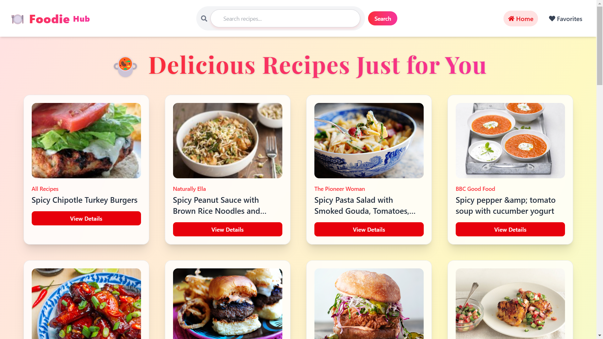
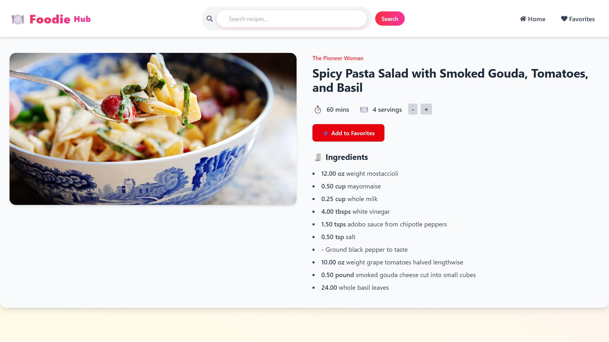
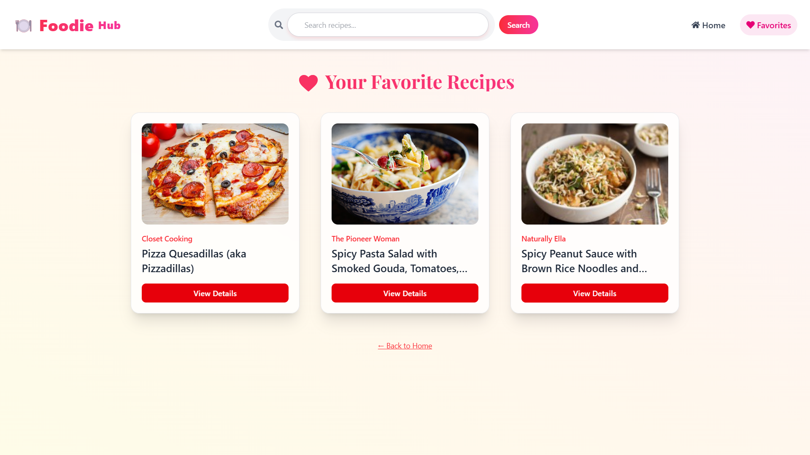

# 🍽️ FoodieHub — Discover Delicious Recipes Instantly

Welcome to **FoodieHub**, your personal cooking companion!  
Search thousands of recipes, view ingredients by servings, save your favorites, and explore curated meals — all in a beautifully animated and responsive app.

---

## 🚀 Live Demo

🔗 [View the App](https://your-deployment-link.vercel.app)

---

## ✨ Features

- 🔍 **Live Recipe Search** using Forkify API
- 🥗 **Default Recipes** on First Load (No empty homepage!)
- 🍽️ **Detailed Recipe Page**
  - Cooking Time ⏱️ + Servings 👥
  - Dynamically adjusted **ingredient quantities**
  - Increase/Decrease servings with smooth animation
- ❤️ **Favorites Section**
  - Persistent with LocalStorage
  - Beautiful card layout
- 🧠 **Context API** for global state management
- 🎨 **Modern UI**
  - TailwindCSS + Gradient styling
  - Custom fonts (`Playfair Display`, `Inter`)
  - Responsive, clean & accessible layout

---

## 📸 Preview

| Home Page                     | Recipe Details                   | Favorites                            |
| ----------------------------- | -------------------------------- | ------------------------------------ |
|  |  |  |

---

## 🛠️ Tech Stack

| Tech              | Description                 |
| ----------------- | --------------------------- |
| **React**         | Frontend framework          |
| **React Router**  | SPA routing                 |
| **Context API**   | Global state management     |
| **Tailwind CSS**  | Utility-first UI styling    |
| **Framer Motion** | Ingredient animation        |
| **Forkify API**   | External recipe data source |

---

## 📁 Project Structure

src/
│
├── components/
│ ├── navbar/
│ └── recipe-item/
│
├── context/ # Global state & API calls
│
├── pages/
│ ├── home/
│ ├── details/
│ └── favorites/
│
├── App.jsx
└── App.css

---

## 📦 Installation

```bash
# 1. Clone the repository
git clone https://github.com/sanketmalvi/foodiehub.git
cd foodiehub

# 2. Install dependencies
npm install

# 3. Start the dev server
npm start
```
